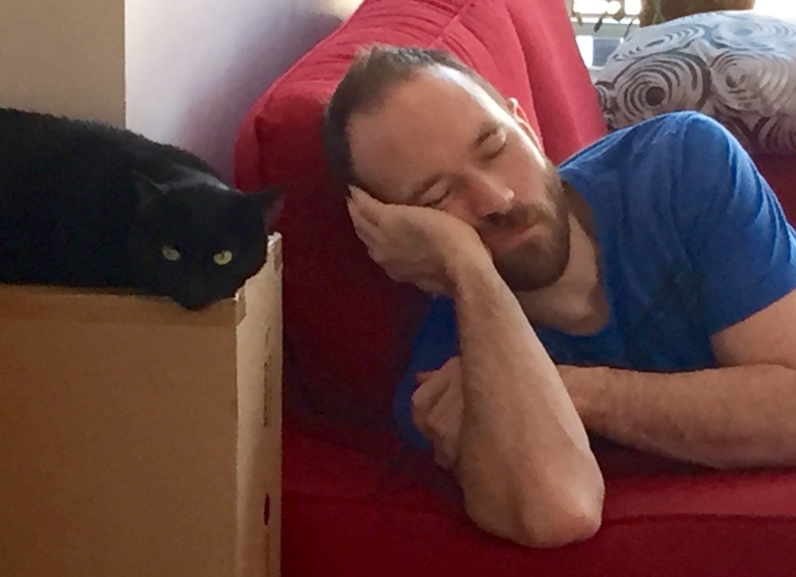

# Welcome to Martin's Awesome Project page. Enter my lair!

This is GitHub page page to describe the various projects done in that repo.

## Pet Feeder Pet Project (PFPP)

(Also formaly known as Beast Feed'Her or BFH for short.)

PFPP is the 1st project done in MAP.
PFPP is a smart, connected pet feeder for my pet cat.

The reasons why I wanted to do this project (beside the obvious utility to feed my cat while I'm out!) are:

*  Learn about QP event-driven state-machine framework.
*  Learn about ARM-Cortex M3 MCU.
*  Learn about IoT and mobile applications.

  

The very first version was going to be a "smart" device, e.g. being able to program it and operating autonomously afterward. this version never saw the daylight as I went straight to the "connected" version of it soon after start.

As said above, the next (and current) iteration is to make it a "connected" device. This means its configuration and operation can be accessed via local network (LAN and potentially WLAN), mobile devices over BlueTooth, and such.

Eventually, I aim at making it an IoT device, where its overall configuration/operation can be done through the Cloud.

### GitHub repo

The entire code can be accessed here: https://github.com/smartinou/map

I'm the sole contributor of code for this project.

### Design Documents

#### 1st Version

*  [Electronics](./bfh_electronics)
   * [Adapter board construction](./bfh_adapter)
*  [Firmware](./bfh_firmware)
   * [class diagrams](./bfh_class_diagrams)
   * [state machines](./bfh_state_machines)
*  [software](./bfh_software)

#### 2nd Version

* [Adapter board construction](./pfpp_adapter)

## High Power Rocket Flight Computer

### Achievement unlocked!

Mid-October 2019, I got my CAR level-1 High Power Rocket (HPR) Certification flying my MadCow Torrent rocket (affectionally called **Cloud Buster**, thanks to my friend Louis) at the October Sky launch event of the CQF club (http://www.clubqf.ca/index.html). The whole thing required passing an exam (with a passing grade of 100% on Transport Canada section), successful flight **AND** recovery, all of that entirely witnessed/supervised, doubled-checked and signed. No rubber stamping...

Now as much as propulsion and aerodynamics are fun, my thing is really about avionics and flight computers: I've wanted to build my own for a long time. So this project is about building avionics electronics and firmware for putting in my HPR rocket models. some of the things I want it to be able to achieve are:

*  Determine apogee and trigger pyros events for chute deployment in single- or dual-deployment flights. 
*  Logging of events and various flight data like: acceleration, 3-axis position, time of flight, etc.
*  Transmit in-flight data to ground through a radio link.
*  Configure the flight parameter through mobile device while on the lauching pad.
*  Broadcast landing position over GSM or other means.
*  ... and more I can't think of right now.

  

  

### Phases

In order to get there, here's a rough plan of various phases to achieve:

*  Get HPR certification level 2 ('I' motor): optional, but can fly more powerful rockets!!!
*  Build electronics & FW version 1: fly in recording mode only.
   *  This is a mean to see if main events can be properly sampled and logged for further analysis.
*  Update FW to perform deployment of chute in single-deployment flight.
   *  Still use the motor deployment as a backup mean.
*  Update FW to support dual-deployment flights.
*  Add other bells and whistles.

To be continued...

