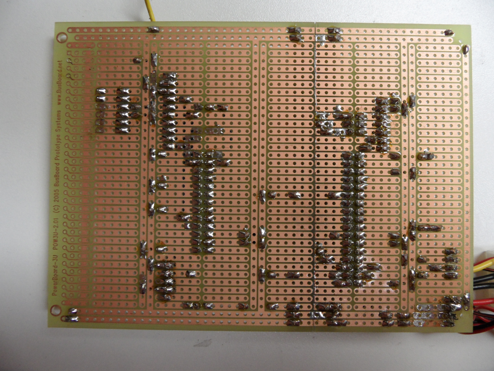
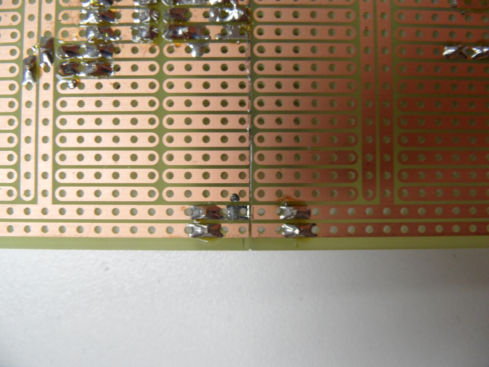

# Adapter Board

And adapter board is required to host the main MCU development board, all the 3rd-party boards, \
and connectors to power and some cable harness to remote 3rd-party boards.

## Construction

I chose _BPS (Busboard Prototype Systems)_ for holding the various components and connectors.
I just love the FR4 glass-epoxy substrate that they offer. Way better than those brown bakelite boards!

[BPS web site](www.BusBoard.com)

*  Both boards 100 x 160mm (6.3 x 3.9"), single height (3U) Eurocard.
*  The grid is 38 by 62 holes, drilled 0.100" on centers.

The main board is the PowerBoard-U3 (part #POWU3).

I also required a small bit of StripBoard-U3 (part #STU3). I'll explain why with the pictures.

### Back Side

This is a picture of the backside.
The board had to be cut and glued back together in order for the IDC connectors of the MCU board to fall on the right strips.
I performed this operation on my table saw, with a cross-cut sled. FR4 material is cut very nicely with clean edges.

The outer strips are used for ground and power rails (3.3V, 5V, 12V).

The next picture shows a zoom on the glued seam. I used 30-min epoxy, spread very thin. A very small amount of oozing can be seen.
The challenge is to keep the holes spread 0.1" apart. Using male IDC connectors is handy while the glue set.

### Front Side

