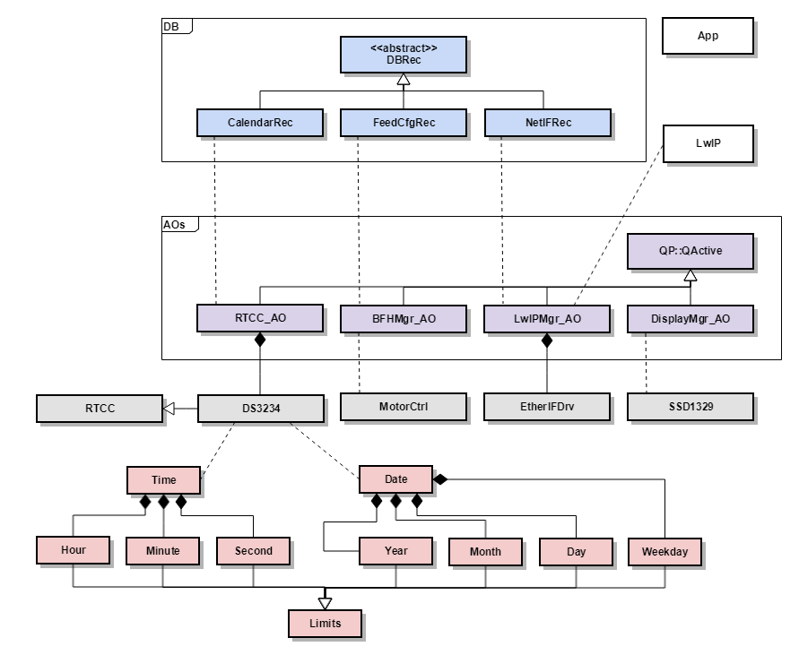
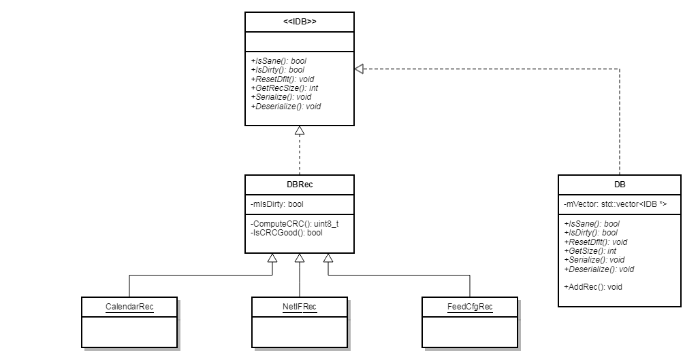

# Class Diagrams

Class diagrams for modules, and overall applications.

# Application

## Active Objects

These are the Active Objects, derived from QP::Active base class from QP's framework.

    > QM is a GUI modeling tool that it used to draw UML state diagrams,
    > and generates code that represent the state machine.
    > When used so, the Active Objects are derived from QP::QMActive.
    >
    > In this project, I coded the Active Objects by hand, 
    > so they are derived from QP::QActive.

### RTCC AO

This is the Active Object for the Real-Time Clock and Calendar (RTCC).
The RTCC AO manages the periodic interrupts and alarms from the RTCC. The RTCC uses a CalendarRec to schedule the alarms of the system,
like the feeding times and such.

### Beast Feed'Her Manager AO (BFHMgr_AO)

This is the Active Object used to managed the different calendar events triggered by the RTCC.
It is also used to manage the different feeding buttons (timed or one-time feeding shot).

### LwIP Manager AO (LwIPMgr_AO)

This Active Object is used to manage the IP stack receive and transmit signals,
as well as the timers used to service certain IP stack events.

It heavily copied from the [application note from QP](https://www.state-machine.com/doc/AN_QP_and_lwIP.pdf)

### Display Manager AO (DisplayMgr_AO)

This AO manages all events sent to the display.

## DB

This is a collection of classes to handle database records.

IDB is the main interfaces for all concrete classes.
*  DBRec is the concrete class used to derived specific record objects.
*  DB is a class used to hold a list of records.

### Derived DBRec

An abstract class that provides an interface to implement for each derived DB rec.

*  CalendarRec: 24-H weekly calendar to hold feeding times.
*  FeedCfgRec: feeding configuration record (feeding time, feeding pads enable/disable, etc.)
*  NetIFRec: configuration record to hold IP configuration options (mode, IP address/subnet mask/default gateway).

## Time and Date classes

A collection of classes to manipulate time and date. Used by RTCC, Calendar and other classes.

## Misc HW classes

A collection of classes to represent different HW components.

*  RTCC: a base class that provides interface for RTCC functions.
*  DS3234: a concrete RTCC class.
*  MotorCtrl: a class to provide functionality for brushless motor controller.
*  EtherIFDrv: a class that represents the Ethernet driver (low-level transfer functions)SSD. Used by the LwIP Manager AO.
*  SSD1329: a driver for OLED controller.

