# Electronics

## Introduction

Based on EKI-LM3S6965 dev board (ARM Cortex-M3), now owned by TI: [link](http://www.ti.com/product/LM3S6965)

[datasheet](http://www.ti.com/lit/ug/spmu029a/spmu029a.pdf)

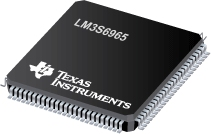
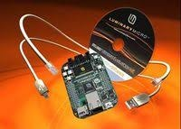

    > __Not recommended for new designs__
    >
    > This MCU is obsoleted and not recommended for new designs.
    >
    > This board was chosen because I had one sleeping on my desk.
    > HW and FW are done so that they could easily be ported to another
    > TI-based MCU/dev board, or any ARM Cortex-MCU.

__Key Features__
*  50MHz clock
*  256KB embedded flash
*  64KB embedded RAM
*  10/100 Ethernet port (MAC + PHY)

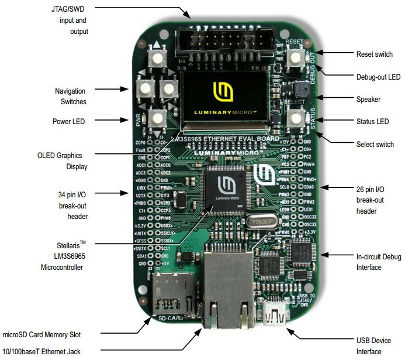

## Block Diagrams

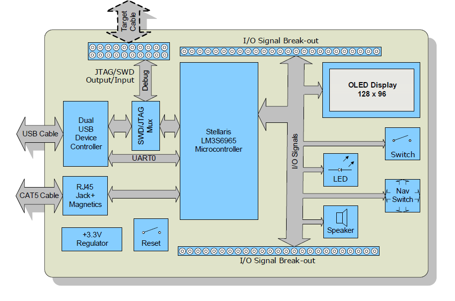

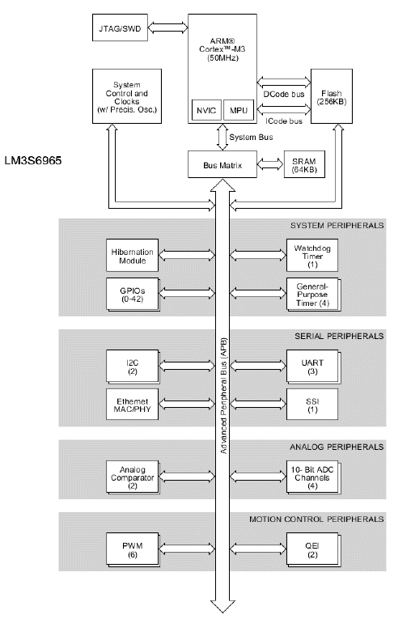

## Pinout

The dev board has two breakout connectors. Some of the pins have a dedicated usage on the dev board. Some of the dev board features (and thus pins) are used, like the OLED display, buzzer, navigation buttons, etc.

If an alternate use of the pin is required, a soldering bridge can be cut to free the pin from its dedicated usage.

The following tables show the allocated usage for each breakout connectors.

<table class="confluenceTable"><colgroup><col/> <col/> <col/> <col/> <col/> <col/> <col/><col/></colgroup><tbody><tr><th class="confluenceTh">Comment</th><th class="confluenceTh">EK Usage</th><th class="confluenceTh">Description</th><th class="confluenceTh">Pad No</th><th class="confluenceTh">Pad No</th><th class="confluenceTh">Description</th><th class="confluenceTh">EK Usage</th><th class="confluenceTh">Comment</th></tr><tr><td class="confluenceTd">Cat feed pad out.</td><td class="confluenceTd"> </td><td class="confluenceTd">PD4/CCP0</td><td class="confluenceTd">34</td><td class="confluenceTd">33</td><td class="confluenceTd">PB4/C0-</td><td class="confluenceTd"> </td><td class="confluenceTd"> </td></tr><tr><td class="confluenceTd"> </td><td class="confluenceTd"> </td><td class="confluenceTd">PD6/FAULT</td><td class="confluenceTd">32</td><td class="confluenceTd">31</td><td class="confluenceTd">PD5/CCP2</td><td class="confluenceTd"> </td><td class="confluenceTd"> </td></tr><tr><td class="highlight-grey confluenceTd" data-highlight-colour="grey"> </td><td class="highlight-grey confluenceTd" data-highlight-colour="grey"> </td><td class="highlight-grey confluenceTd" data-highlight-colour="grey">GND</td><td class="highlight-grey confluenceTd" data-highlight-colour="grey">30</td><td class="confluenceTd">29</td><td class="confluenceTd">PD7/CCP1</td><td class="confluenceTd"> </td><td class="confluenceTd"> </td></tr><tr><td class="confluenceTd"> </td><td class="confluenceTd"> </td><td class="confluenceTd">ADC1</td><td class="confluenceTd">28</td><td class="confluenceTd">27</td><td class="confluenceTd">ADC0</td><td class="confluenceTd"> </td><td class="confluenceTd"> </td></tr><tr><td class="confluenceTd"> </td><td class="confluenceTd"> </td><td class="confluenceTd">ADC3</td><td class="confluenceTd">26</td><td class="confluenceTd">25</td><td class="confluenceTd">ADC2</td><td class="confluenceTd"> </td><td class="confluenceTd"> </td></tr><tr><td class="highlight-blue confluenceTd" data-highlight-colour="blue">SmartCard SPI CSn signal.</td><td class="highlight-blue confluenceTd" data-highlight-colour="blue">CARDCSn</td><td class="highlight-blue confluenceTd" data-highlight-colour="blue">PD0/IDX0*</td><td class="highlight-blue confluenceTd" data-highlight-colour="blue">24</td><td class="highlight-grey confluenceTd" data-highlight-colour="grey">23</td><td class="highlight-grey confluenceTd" data-highlight-colour="grey">GND</td><td class="highlight-grey confluenceTd" data-highlight-colour="grey"> </td><td class="highlight-grey confluenceTd" data-highlight-colour="grey"> </td></tr><tr><td class="confluenceTd"> </td><td class="confluenceTd"> </td><td class="confluenceTd">PD2/U1RX</td><td class="confluenceTd">22</td><td class="confluenceTd">21</td><td class="confluenceTd">PD1/PWM1*</td><td class="confluenceTd">SOUND</td><td class="confluenceTd">Speaker.</td></tr><tr><td class="confluenceTd"> </td><td class="confluenceTd"> </td><td class="confluenceTd">PG1/U2TX</td><td class="confluenceTd">20</td><td class="confluenceTd">19</td><td class="confluenceTd">PD3/U1TX</td><td class="confluenceTd"> </td><td class="confluenceTd"> </td></tr><tr><td class="confluenceTd">Data/Control#</td><td class="confluenceTd">OLEDDC</td><td class="confluenceTd">PC7/PHBO*</td><td class="confluenceTd">18</td><td class="confluenceTd">17</td><td class="confluenceTd">PG0/U2RX</td><td class="confluenceTd"> </td><td class="confluenceTd"> </td></tr><tr><td class="confluenceTd"> </td><td class="confluenceTd"> </td><td class="confluenceTd">PC5/C1+</td><td class="confluenceTd">16</td><td class="confluenceTd">15</td><td class="confluenceTd">PC6/CCP3*</td><td class="confluenceTd">EN+15V</td><td class="confluenceTd">OLED +15V enable.</td></tr><tr><td class="highlight-grey confluenceTd" data-highlight-colour="grey"> </td><td class="highlight-grey confluenceTd" data-highlight-colour="grey"> </td><td class="highlight-grey confluenceTd" data-highlight-colour="grey">GND</td><td class="highlight-grey confluenceTd" data-highlight-colour="grey">14</td><td class="confluenceTd">13</td><td class="confluenceTd">PC4/PHA0</td><td class="confluenceTd"> </td><td class="confluenceTd">Manual feed pad out.</td></tr><tr><td class="highlight-red confluenceTd" data-highlight-colour="red"> </td><td class="highlight-red confluenceTd" data-highlight-colour="red"> </td><td class="highlight-red confluenceTd" data-highlight-colour="red">+3.3V</td><td class="highlight-red confluenceTd" data-highlight-colour="red">12</td><td class="confluenceTd"><strong>11</strong></td><td class="confluenceTd"><strong>PA0/U0RX*</strong></td><td class="confluenceTd"><strong>VCP_RX</strong></td><td class="confluenceTd"><strong>USB Stuff. Don't touch.</strong></td></tr><tr><td class="confluenceTd"><strong>USB Stuff. Don't touch.</strong></td><td class="confluenceTd"><strong>VCP_TX</strong></td><td class="confluenceTd"><strong>PA1/U0TX*</strong></td><td class="confluenceTd"><strong>10</strong></td><td class="highlight-blue confluenceTd" data-highlight-colour="blue">9</td><td class="highlight-blue confluenceTd" data-highlight-colour="blue">PA2/SSI0CLK*</td><td class="highlight-blue confluenceTd" data-highlight-colour="blue">SSICLK</td><td class="highlight-blue confluenceTd" data-highlight-colour="blue">SPI Clock signal.</td></tr><tr><td class="highlight-blue confluenceTd" data-highlight-colour="blue">RTI OLED display SPI CSn signal.</td><td class="highlight-blue confluenceTd" data-highlight-colour="blue">OLEDCSn</td><td class="highlight-blue confluenceTd" data-highlight-colour="blue">PA3/SS0FS*</td><td class="highlight-blue confluenceTd" data-highlight-colour="blue">8</td><td class="highlight-blue confluenceTd" data-highlight-colour="blue">7</td><td class="highlight-blue confluenceTd" data-highlight-colour="blue">PA4/SSI0RX*</td><td class="highlight-blue confluenceTd" data-highlight-colour="blue">SSIRX</td><td class="highlight-blue confluenceTd" data-highlight-colour="blue">SPI Rx signal.</td></tr><tr><td class="highlight-blue confluenceTd" data-highlight-colour="blue">SPI Tx signal.</td><td class="highlight-blue confluenceTd" data-highlight-colour="blue">SSITX</td><td class="highlight-blue confluenceTd" data-highlight-colour="blue">PA5/SSI0TX*</td><td class="highlight-blue confluenceTd" data-highlight-colour="blue">6</td><td class="confluenceTd">5</td><td class="confluenceTd">PA6/SCL1</td><td class="confluenceTd"> </td><td class="confluenceTd">RTCC SQW.</td></tr><tr><td class="confluenceTd">RTCC CSn</td><td class="confluenceTd"> </td><td class="confluenceTd">PA7/SDA1</td><td class="confluenceTd">4</td><td class="highlight-grey confluenceTd" data-highlight-colour="grey">3</td><td class="highlight-grey confluenceTd" data-highlight-colour="grey">GND</td><td class="highlight-grey confluenceTd" data-highlight-colour="grey"> </td><td class="highlight-grey confluenceTd" data-highlight-colour="grey"> </td></tr><tr><td class="highlight-grey confluenceTd" data-highlight-colour="grey"> </td><td class="highlight-grey confluenceTd" data-highlight-colour="grey"> </td><td class="highlight-grey confluenceTd" data-highlight-colour="grey">GND</td><td class="highlight-grey confluenceTd" data-highlight-colour="grey">2</td><td class="highlight-red confluenceTd" data-highlight-colour="red">1</td><td class="highlight-red confluenceTd" data-highlight-colour="red">+5V</td><td class="highlight-red confluenceTd" data-highlight-colour="red"> </td><td class="highlight-red confluenceTd" data-highlight-colour="red"> </td></tr></tbody></table>

* * *
    
<table class="confluenceTable"><colgroup><col/> <col/> <col/> <col/> <col/> <col/> <col/><col/></colgroup><tbody><tr><th class="confluenceTh">Comment</th><th class="confluenceTh">EK Usage</th><th class="confluenceTh">Description</th><th class="confluenceTh">Pad No</th><th class="confluenceTh">Pad No</th><th class="confluenceTh">Description</th><th class="confluenceTh">EK Usage</th><th class="confluenceTh">Comment</th></tr><tr><td class="highlight-red confluenceTd" data-highlight-colour="red"> </td><td class="highlight-red confluenceTd" data-highlight-colour="red"> </td><td class="highlight-red confluenceTd" data-highlight-colour="red">+12V</td><td class="highlight-red confluenceTd" data-highlight-colour="red">35</td><td class="highlight-grey confluenceTd" data-highlight-colour="grey">36</td><td class="highlight-grey confluenceTd" data-highlight-colour="grey">GND</td><td class="highlight-grey confluenceTd" data-highlight-colour="grey"> </td><td class="highlight-grey confluenceTd" data-highlight-colour="grey"> </td></tr><tr><td class="confluenceTd">Motor controller BIN2.</td><td class="confluenceTd"> </td><td class="confluenceTd">PB5/C1-</td><td class="confluenceTd">37</td><td class="confluenceTd">38</td><td class="confluenceTd">PB6/C0+</td><td class="confluenceTd"> </td><td class="confluenceTd">Motor controller BIN1.</td></tr><tr><td class="confluenceTd"> </td><td class="confluenceTd">JTAG</td><td class="confluenceTd">PB7/TRSTn</td><td class="confluenceTd">39</td><td class="confluenceTd">40</td><td class="confluenceTd">PC2/TDI*</td><td class="confluenceTd">JTAG</td><td class="confluenceTd"> </td></tr><tr><td class="confluenceTd"> </td><td class="confluenceTd">JTAG</td><td class="confluenceTd">PC3/TDO*</td><td class="confluenceTd">41</td><td class="highlight-yellow confluenceTd" data-highlight-colour="yellow">42</td><td class="highlight-yellow confluenceTd" data-highlight-colour="yellow">PE3/PHA1*</td><td class="highlight-yellow confluenceTd" data-highlight-colour="yellow">RIGHT_SWn</td><td class="highlight-yellow confluenceTd" data-highlight-colour="yellow">Right Button.</td></tr><tr><td class="highlight-yellow confluenceTd" data-highlight-colour="yellow">Left button.</td><td class="highlight-yellow confluenceTd" data-highlight-colour="yellow">LEFT_SWn</td><td class="highlight-yellow confluenceTd" data-highlight-colour="yellow">PE2/PHB1*</td><td class="highlight-yellow confluenceTd" data-highlight-colour="yellow">43</td><td class="highlight-grey confluenceTd" data-highlight-colour="grey">44</td><td class="highlight-grey confluenceTd" data-highlight-colour="grey">GND</td><td class="highlight-grey confluenceTd" data-highlight-colour="grey"> </td><td class="highlight-grey confluenceTd" data-highlight-colour="grey"> </td></tr><tr><td class="highlight-yellow confluenceTd" data-highlight-colour="yellow">Up button.</td><td class="highlight-yellow confluenceTd" data-highlight-colour="yellow">UP_SWn</td><td class="highlight-yellow confluenceTd" data-highlight-colour="yellow">PE0/PWM4*</td><td class="highlight-yellow confluenceTd" data-highlight-colour="yellow">45</td><td class="highlight-yellow confluenceTd" data-highlight-colour="yellow">46</td><td class="highlight-yellow confluenceTd" data-highlight-colour="yellow">PE1/PWM5*</td><td class="highlight-yellow confluenceTd" data-highlight-colour="yellow">DOWN_SWn</td><td class="highlight-yellow confluenceTd" data-highlight-colour="yellow">Down Button.</td></tr><tr><td class="confluenceTd">Reserved for I2C.</td><td class="confluenceTd"> </td><td class="confluenceTd">PB2/SCL0</td><td class="confluenceTd">47</td><td class="confluenceTd">48</td><td class="confluenceTd">PB3/SDA0</td><td class="confluenceTd"> </td><td class="confluenceTd">Reserved for I2C.</td></tr><tr><td class="confluenceTd"> </td><td class="confluenceTd"> </td><td class="confluenceTd">PB1/PWM3</td><td class="confluenceTd">49</td><td class="highlight-grey confluenceTd" data-highlight-colour="grey">50</td><td class="highlight-grey confluenceTd" data-highlight-colour="grey">GND</td><td class="highlight-grey confluenceTd" data-highlight-colour="grey"> </td><td class="highlight-grey confluenceTd" data-highlight-colour="grey"> </td></tr><tr><td class="highlight-yellow confluenceTd" data-highlight-colour="yellow">Select button.</td><td class="highlight-yellow confluenceTd" data-highlight-colour="yellow">SELECT_SWn</td><td class="highlight-yellow confluenceTd" data-highlight-colour="yellow">PF1/IDX1*</td><td class="highlight-yellow confluenceTd" data-highlight-colour="yellow">51</td><td class="confluenceTd">52</td><td class="confluenceTd">PB0/PWM2</td><td class="confluenceTd"> </td><td class="confluenceTd">Motor controller PWMA input.</td></tr><tr><td class="confluenceTd">RJ45 Link/Activity LED.</td><td class="confluenceTd">LED0</td><td class="confluenceTd">PF3/LED0*</td><td class="confluenceTd">53</td><td class="confluenceTd">54</td><td class="confluenceTd">PF2/LED1*</td><td class="confluenceTd">LED1</td><td class="confluenceTd">RJ45 Link/Activity LED.</td></tr><tr><td class="highlight-grey confluenceTd" data-highlight-colour="grey"> </td><td class="highlight-grey confluenceTd" data-highlight-colour="grey"> </td><td class="highlight-grey confluenceTd" data-highlight-colour="grey">GND</td><td class="highlight-grey confluenceTd" data-highlight-colour="grey">55</td><td class="confluenceTd">56</td><td class="confluenceTd">OSC32</td><td class="confluenceTd"> </td><td class="confluenceTd"> </td></tr><tr><td class="highlight-grey confluenceTd" data-highlight-colour="grey"> </td><td class="highlight-grey confluenceTd" data-highlight-colour="grey"> </td><td class="highlight-grey confluenceTd" data-highlight-colour="grey">GND</td><td class="highlight-grey confluenceTd" data-highlight-colour="grey">57</td><td class="confluenceTd">58</td><td class="confluenceTd">OSC32</td><td class="confluenceTd"> </td><td class="confluenceTd"> </td></tr><tr><td class="confluenceTd">Status LED.</td><td class="confluenceTd">LED2</td><td class="confluenceTd">PF0/PWM0*</td><td class="confluenceTd">59</td><td class="highlight-red confluenceTd" data-highlight-colour="red">60</td><td class="highlight-red confluenceTd" data-highlight-colour="red">+3.3V</td><td class="highlight-red confluenceTd" data-highlight-colour="red"> </td><td class="highlight-red confluenceTd" data-highlight-colour="red"> </td></tr></tbody></table>

__This is a test table using MarkDown__

| Comment          | EK Usage | Description | Pad No | Pad No | Description | EK Usage | Comment  |
|:-----------------|:---------|:------------|:-------|:-------|:------------|:---------|:---------|
| Cat feed pad out.|          | PD4/CCP0    | 34     | 33     | PB4/C0-     |          |          |
|                  |          | PD6/FAULT   | 32     | 31     | PD5/CCP2    |          |          |
|   |   | GND	| 30 | 29 | PD7/CCP1 |   |   |
|   |   | ADC1  | 28 | 27 | ADC0     |   |   |
|   |   | ADC3  | 26 | 25 | ADC2     |   |   |
| SmartCard SPI CSn signal. | CARDCSn | PD0/IDX0* | 24 | 23 | GND |   |   |

    > In tables above, an asterisk (*) by a signal name (also on the EVB PCB) indicates the signal
    > is normally used for on-board functions.
    >
    > Normally, you should cut the associated jumper (JP1-15) before using an assigned signal
    > for external interfacing.
    
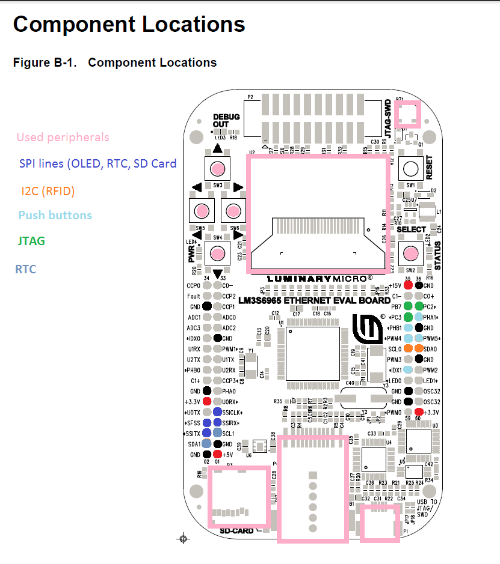

## Adapter Board

An adapter board has to be build for interfacing the MCU dev board with all the various 3rd-party extension/breakout boards.

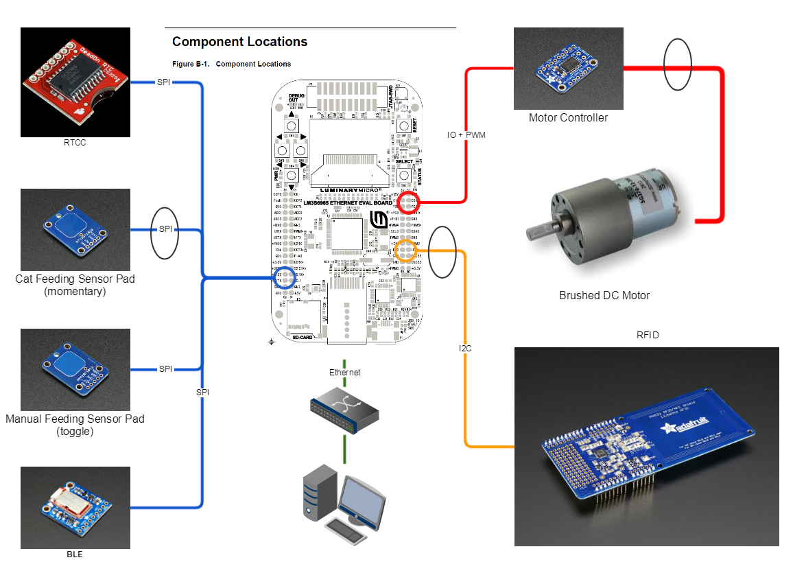

[Adapter board construction](./bfh_adapter)

## 3rd-Party Extension/Breakout Boards

### Touch sensors
Manual Feed Pad is done with a toggle  capacitive touch sensor from AdaFruit. It is based on AT42QT1012.

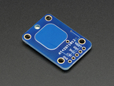
<https://www.adafruit.com/product/1375>

Cat Feed Pad is done with a momentary capacitive touch sensor from AdaFruit. It is based on AT42QT1010. It is installed away from the main board, linked to it via a connector.

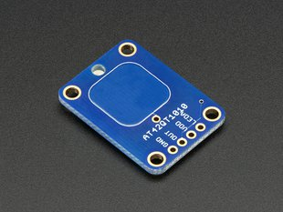
<https://www.adafruit.com/?q=at42qt1010>

### PWM motor controller
The DC/Stepper motor controller breakout board is the one from AdaFruit. It can control two motors. It is build around TB6612 motor driver. Only  motor controller half 'A' is used.

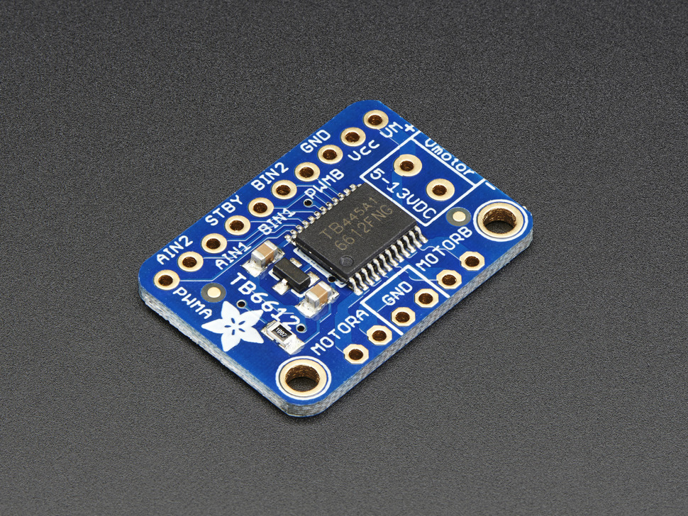
<https://www.adafruit.com/product/2448>

### RTCC
The RTCC breakout board is from SparkFun. It is build on the DS3234.

It was selected because of its accuracy (temperature compensated), alarm capabilities and its battery-backup'ed RAM. It is used by FW to store settings

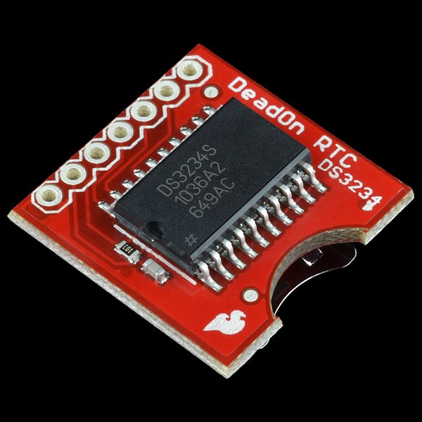
<https://www.sparkfun.com/products/10160>

### RFID Detector
The RFID controller from AdaFruit is installed remotely of the board using a connector.

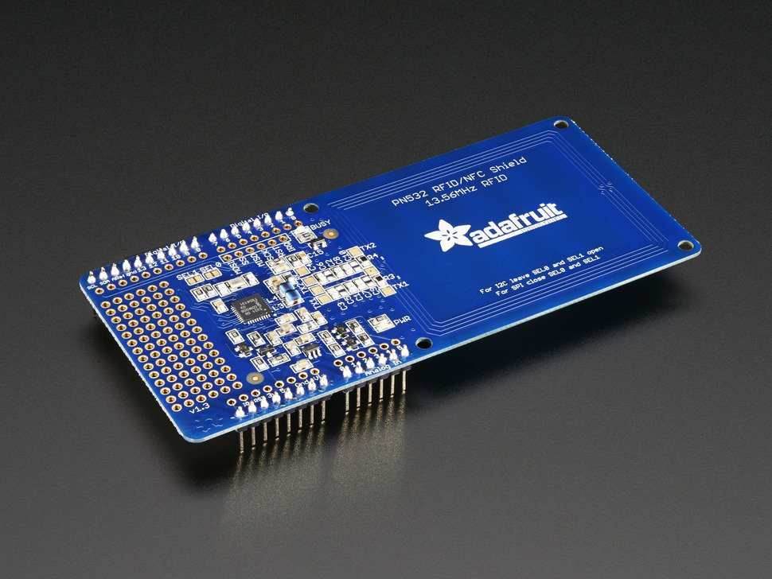
<https://www.adafruit.com/product/789>

### Bluetooth Low Energy (BLE)
The BLE board is from Adafruit. This version uses an SPI interface to communicate with the MCU.

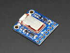
<https://www.adafruit.com/product/2633>
