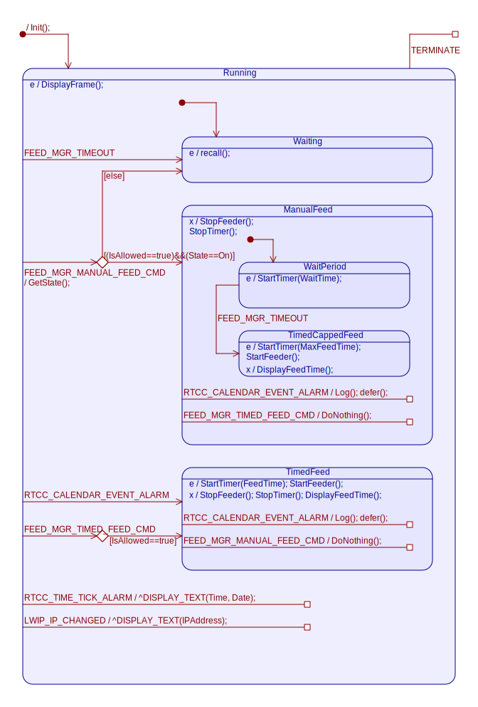

# State Machines & Signals

This page details the various state machines used in the firmware.

As explained in another page, QM modeling tool __was not__ initially used to create the various code representing the 
state machines of the system. Instead, they were all coded by hand, deriving from the proper QP base class.

    > I later used QM modeling tool to try it out, and re-modeled some of the state machines
    > of this project (LwIPMgr_AO and DisplayMgr_AO).
    > I found really useful that the tool both generates the code, and the state machine diagrams.
    > 
    > This removes the step of having to use other tools to create UML state machine diagrams,
    > thus following the "don't repeat yourself" (DRY) rule.
    
    > edit of 2019-11-13:
    > I undertook the task of porting all state machines under QM.
    > The update diagrams are directly generated from QM.
 
## RTCC_AO
 
The RTCC manages the periodic and alarm interrupts.
 
When one of the two happen, it simply publish an event to the QP framework that such thing occurred.

    > The periodic interrupt can be set to the desired response granularity of the system.
    > For instance, it is possible to set the periodic alarm to every minute,
    > leaving the system in low power mode in between interrupts.
    >
    > Currently the periodic interrupt is set to the second for better observability.

### Diagram

### Signal List

| Signal Name | Direction | Parameter | Comments |
|:------------|:----------|:----------|:---------|
| RTCC_INTERRUPT_SIG | In | None | Generated by RTCC. Two alarm sources: Time base tick. Calendar event alarm. | 
| RTCC_TIME_TICK_ALARM_SIG | Out | Time and Date | Signals newest time and date (and temperature?) |
| RTCC_CALENDAR_EVENT_ALARM_SIG | Out | Time and Date | Signals a calendar event occured, at given Time and Date. |
| RTCC_SAVE_TO_NV_MEM_SIG | In | IsDBChanged | Used to update the whole DB into the NV memory (RAM). |
| RTCC_SET_TIME_SIG | In | Time | Sets new time to set the RTCC to. Triggers new calendar event alarm. |
| RTCC_SET_DATE_SIG | In | Date | Sets new date to set the RTCC to. Triggers new calendar event alarm. |

## LwIPMgr_AO
 
This is the state machine responsible for managing the low-level Ethernet driver with respect to signals.
 
It is copied over 95% of the original application note from QP on how to use LwIP in conjunction with QP,
found [here](https://www.state-machine.com/doc/AN_QP_and_lwIP.pdf)

Nonetheless, the state machine was remodeled in QM, and improvements were made.

### Diagram
 
See the application note above.

### Signal List

See the application note above.

## BFHMgr_AO

The state machine responsible for handling the various feeding and alarm events.

### Diagram

### Signal List

| Signal Name | Direction | Parameter | Comments |
|:------------|:----------|:----------|:---------|
| RTCC_CALENDAR_EVENT_ALARM_SIG | In | Time and Date references | Triggers a timed feeding, from scheduled calendar. |
| FEED_MGR_MANUAL_FEED_CMD_SIG | In | State (on, off) | Triggers a manual feeding, or exit of it. From manual toggle sensor pad. |
| FEED_MGR_TIMED_FEED_CMD_SIG | In | Feeding time | Triggers a timed feeding. From Pet Touch Pad or other. |
| FEED_MGR_TIMEOUT_SIG | In | None | Feeding timeout, Maximum security feeding timeout or debouncing timeout. |
| RTCC_TICK_ALARM | In | Time & Date | Signals the latest time & date. Redirected to display and logging. |
| LWIP_CHANGED_SIG | In | IP/SN/GW | Signals the newest IP address. Redirected to display and logging .|

## DisplayMgr_AO

The display manager's AO job is to answer text events and display them on the OLED display.

The message display time is also managed by this AOto avoid wearing off the display.

### Diagram

### Signal List

| Signal Name | Direction | Parameter | Comments |
|:------------|:----------|:----------|:---------|
| DISPLAY_TEXT_SIG | In | Text, position (x, y), grayscale, {on,off} | string to display. Triggers a 5s-time delay to keep the OLED display on. |
| DISPLAY_TIMEOUT_SIG | In | None | Turn the OLED display off to save matrix. |
| DISPLAY_REFRESH_SIG | In | None | Turn the OLED display on back again for a timed period. |
