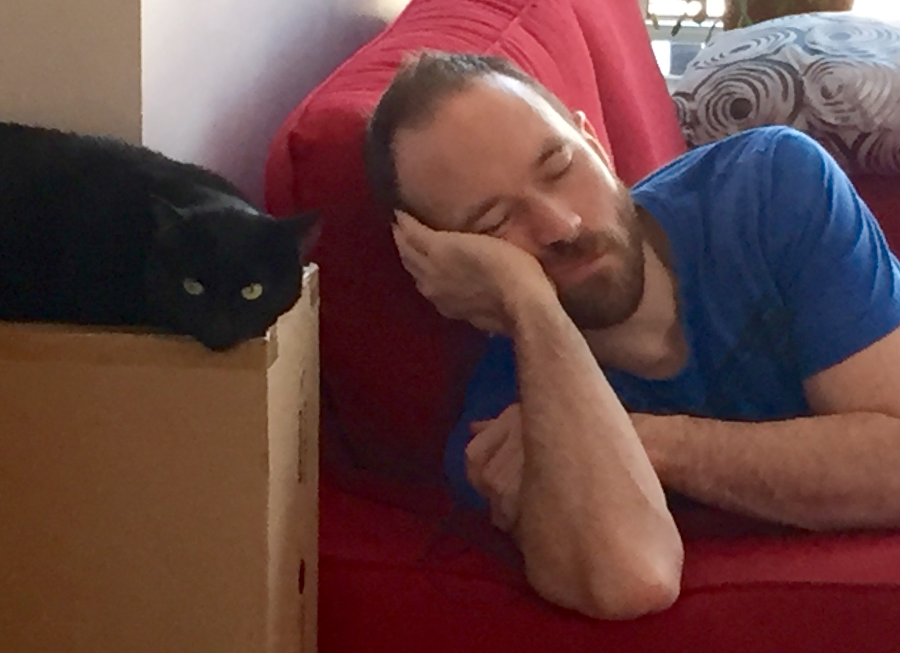

# Welcome to Martin's Awesome Project page. Enter my lair!

This is GitHub page page to describe the various projects done in that repo.

## Pet Feeder Pet Project (PFPP)

(Also formaly known as Beast Feed'Her or BFH for short.)

PFPP is the 1st project done in MAP.
PFPP is a smart, connected pet feeder for my pet cat.

The reasons why I wanted to do this project (beside the obvious utility to feed my cat while I'm out!) are:

*  Learn about QP event-driven state-machine framework.
*  Learn about ARM-Cortex M3 MCU.
*  Learn about IoT and mobile applications.

The very first version was going to be a "smart" device, e.g. being able to program it and operating autonomously afterward. this version never saw the daylight as I went straight to the "connected" version of it soon after start.

As said above, the next (and current) iteration is to make it a "connected" device. This means its configuration and operation can be accessed via local network (LAN and potentially WLAN), mobile devices over BlueTooth, and such.

Eventually, I aim at making it an IoT device, where its overall configuration/operation can be done through the Cloud.

### GitHub repo

The entire code can be accessed here: https://github.com/smartinou/map

I'm the sole contributor of code for this project.

### Design Documents

*  [Electronics](./bfh_electronics)
   * [Adapter board construction](./bfh_adapter)
*  [Firmware](./bfh_firmware)
   * [class diagrams](./bfh_class_diagrams)
   * [state machines](./bfh_state_machines)
*  [software](./bfh_software)

